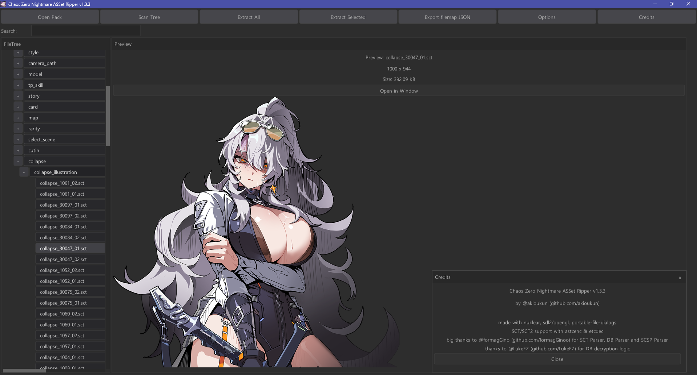

# Chaos Zero Nightmare ASSet Ripper
ASSet Ripper is a tool for extracting encrypted pack assets from yuna engine, or certain anime games.




## [Download](https://nightly.link/akioukun/Chaos-Zero-Nightmare-ASSet-Ripper/workflows/build/main/ChaosZeroNightmareRipper.zip) 
> [!IMPORTANT]
> Releases tab has outdated builds and won't be updated anymore. Download the tool using the link above or via Github [Actions](https://github.com/akioukun/Chaos-Zero-Nightmare-ASSet-Ripper/actions)

## Features
Preview supported formats such as:
- SCT images (exported as PNG files)
- Encrypted databases (exported as JSON files)
- SCSP [spine](https://esotericsoftware.com/spine-in-depth) format (exported as JSON), compatible with tools such as [SpineViewer](https://github.com/ww-rm/SpineViewer)

And export either all files or only selected files and folders, depending on your preference.

## How to use
1) Click `Open Pack` and select `data.pack` located under: `WhereYouInstalledTheGame\ChaosZeroNightmare\bin\appdata\cznlive`
2) Click `Scan Tree` which will scan the files and build game resources file tree
   
## Navigating the File Tree and Exporting
You can navigate the file tree using either mouse or keyboard input.

#### Mouse Controls
- Scroll to move through the file tree
- Click to select items

#### Keyboard Controls
- **Up / Down Arrow** — move selection
- **Left / Right Arrow** — collapse or expand folders

#### Multi-Selection

Multiple files and folders can be selected for batch export:

- **Ctrl + Right Click**
- **Ctrl + Up / Down Arrow**


## Build Instructions

```bash
git clone https://github.com/akioukun/Chaos-Zero-Nightmare-ASSet-Ripper.git
cd Chaos-Zero-Nightmare-ASSet-Ripper
mkdir build && cd build
cmake ..
cmake --build . --config Release
```
